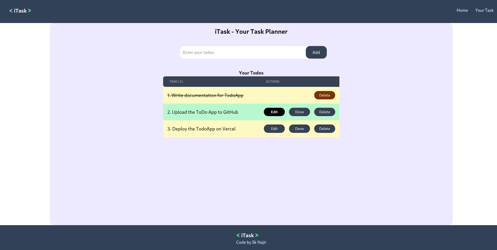

# 📝 iTask - Your Task Planner

🔗 **Live Demo:** [https://to-do-app-opal-eta.vercel.app/]

A simple and elegant task planner built with React. This app allows users to add, edit, complete, and delete their daily tasks. It uses **localStorage** to persist data across sessions and includes user-friendly toasts for notifications.

## 🚀 Features

- ✅ Add new tasks with a simple input field
- ✏️ Edit existing tasks (unless marked completed)
- ✔️ Mark tasks as complete
- ❌ Delete individual tasks
- 💾 Tasks are saved in localStorage
- 🔔 Toast notifications using `react-toastify`
- ⚡ Responsive design with Tailwind CSS

## 📸 Screenshot

 <!-- Add a screenshot file if needed -->

## 🛠️ Tech Stack

- [React](https://reactjs.org/)
- [Vite](https://vitejs.dev/)
- [Tailwind CSS](https://tailwindcss.com/)
- [React Toastify](https://fkhadra.github.io/react-toastify/)

